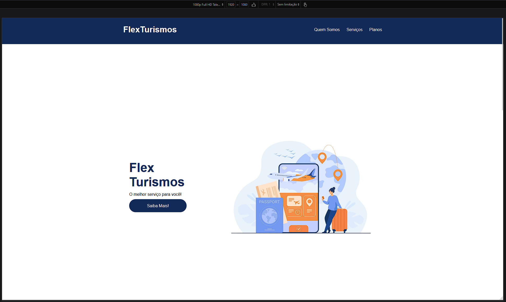
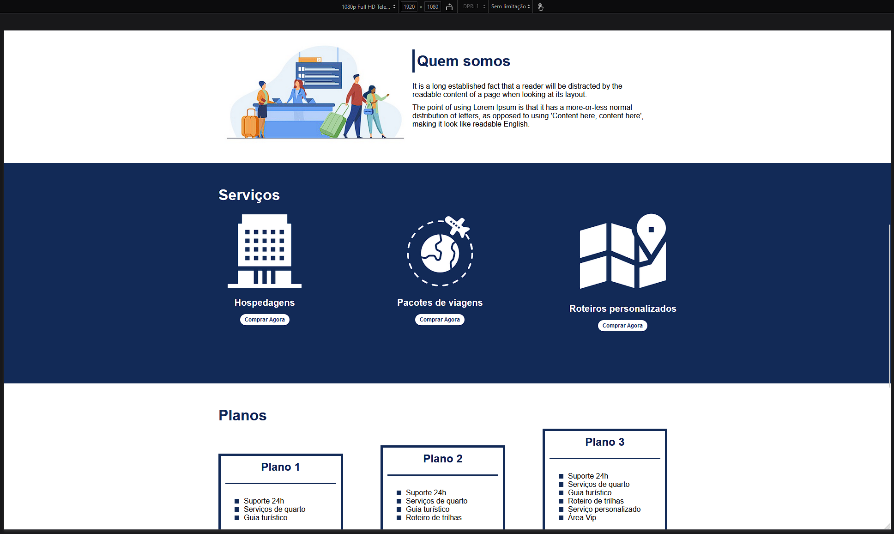
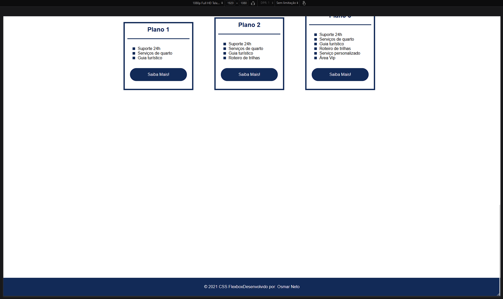
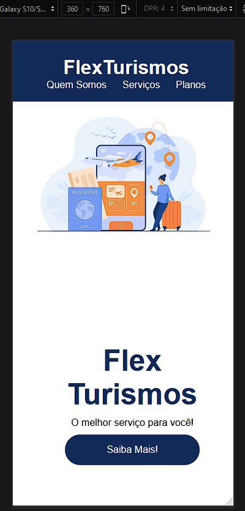
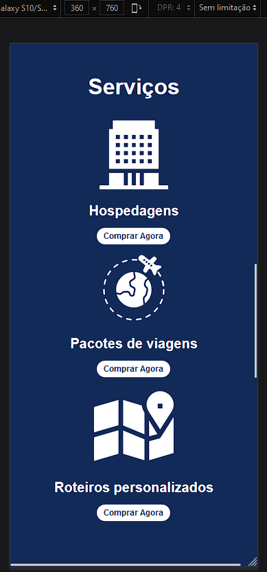
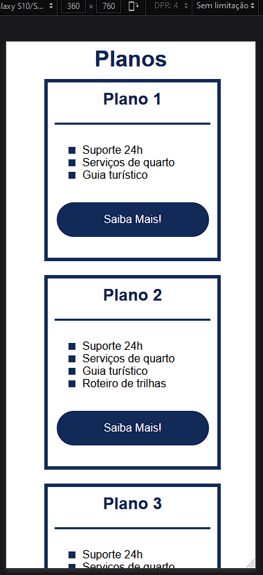
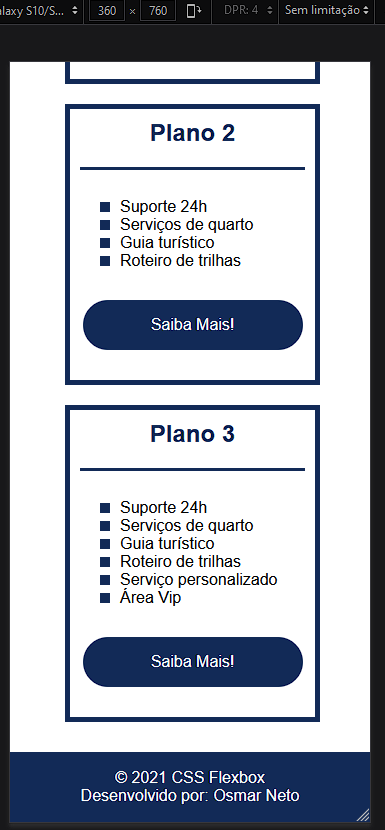
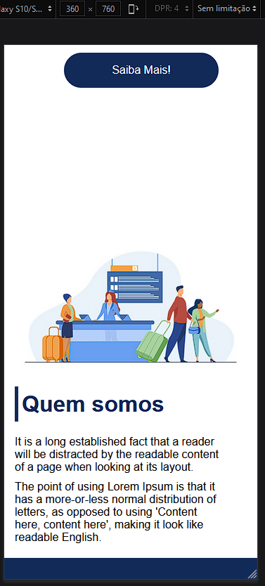

# 🛫 FlexTurismo Landpage

Home page de uma agencia de turismo ficticia, utilizando apenas html, css e flexbox

## 📝 Tecnologias

- HTML
- CSS

## 💻 Landscape

## 📱 Mobile
<<<<<<< HEAD

=======

>>>>>>> 23023b68fc2df2b48138d083c03377211729405d
